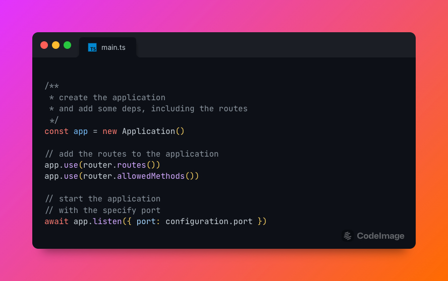

<a name="readme-top"></a>

<!-- PROJECT LOGO -->
<br />
<div align="center">
  <a href="https://github.com/nyomansunima/memee-backend">
    
  </a>

  <h3 align="center">Memee Backend</h3>

  <p align="center">
   The core backend project to handle and supply service for memee. Memee is the website to find the best and funny meme.

This API also can easily used by people around. To use this please read the api specs.
<br />
<a href="https://github.com/nyomansunima/memee-backend"><strong>Explore the docs »</strong></a>
<br />
<br />
<a href="https://github.com/nyomansunima/memee-backend">View Demo</a>
·
<a href="https://github.com/nyomansunima/memee-backend/issues">Report Bug</a>
·
<a href="https://github.com/nyomansunima/memee-backend/issues">Request Feature</a>

  </p>
</div>

<!-- TABLE OF CONTENTS -->

<br/>
<br/>
<details>
  <summary>Table of Contents</summary>
  <ol>
    <li>
      <a href="#about-the-project">About The Project</a>
      <ul>
        <li><a href="#built-with">Built With</a></li>
      </ul>
    </li>
    <li>
      <a href="#getting-started">Getting Started</a>
      <ul>
        <li><a href="#prerequisites">Prerequisites</a></li>
        <li><a href="#installation">Installation</a></li>
      </ul>
    </li>
    <li><a href="#roadmap">Roadmap</a></li>
    <li><a href="#contributing">Contributing</a></li>
    <li><a href="#license">License</a></li>
    <li><a href="#contact">Contact</a></li>
  </ol>
</details>

<br/>
<br/>

<!-- ABOUT THE PROJECT -->

## About The Project



This project is built for just exploration about the Deno Javascript runtime and natively support with typescript. Deno is the successor of node.

This project is mainly focus to run the backend api and serve some of the endpoints for meme.

You also can use this meme api for free by following the api specs. However the capacity of this project may be limited.

<p align="right">(<a href="#readme-top">back to top</a>)</p>

### Built With

To make this project works. This project is built using the best amazing stacks including:

- [Deno](https://deno.land)
- [PlanetScale](https://planetscale.com/)
- [Deno Cloud](https://deno.com)

<p align="right">(<a href="#readme-top">back to top</a>)</p>

<!-- GETTING STARTED -->

## Getting Started

To get started this project please following the several steps and ensure to install all deps needed.

### Prerequisites

Before jump to this project, please install some of the stacks and deps in your local computer.

1. Install Deno, please see the instruction here [Installation](https://deno.land/manual@v1.29.1/getting_started/installation)
2. Install Denon [Documentation](https://deno.land/x/denon@2.5.0)

### Installation

Please follow the following steps to setup this projects.

1. Clone the repo

```bash
  git clone git@github.com:nyomansunima/memee-backend.git
```

2. Install all packages and deps

```deno
  deno cache src/deps.ts
```

3. Start the application

```deno
  denon dev
```

4. Now you can use the api in your local machine at [http://localhost:4000/api](http://localhost:4000/api)

<p align="right">(<a href="#readme-top">back to top</a>)</p>

<!-- ROADMAP -->

## Roadmap

- [x] Adding base api setup
- [x] Release the MVP with all covs resources

See the [open issues](https://github.com/nyomansunima/memee-backend/issues) for a full list of proposed features (and known issues).

<p align="right">(<a href="#readme-top">back to top</a>)</p>

<!-- CONTRIBUTING -->

## Contributing

Contributions are what make the open source community such an amazing place to learn, inspire, and create. Any contributions you make are **greatly appreciated**.

If you have a suggestion that would make this better, please fork the repo and create a pull request. You can also simply open an issue with the tag "enhancement".
Don't forget to give the project a star! Thanks again!

1. Fork the Project
2. Create your Feature Branch (`git checkout -b feature/AmazingFeature`)
3. Commit your Changes (`git commit -m 'Add some AmazingFeature'`)
4. Push to the Branch (`git push origin feature/AmazingFeature`)
5. Open a Pull Request

<p align="right">(<a href="#readme-top">back to top</a>)</p>

<!-- LICENSE -->

## License

Distributed under the MIT License. See `LICENSE.md` for more information.

<p align="right">(<a href="#readme-top">back to top</a>)</p>

<!-- CONTACT -->

## Contact

Nyoman Sunima - [@nyomansunima](https://twitter.com/nyomansunima) - nyomansunima@gmail.com

Project Link: [https://github.com/nyomansunima/memee-backend](https://github.com/nyomansunima/memee-backend)

<p align="right">(<a href="#readme-top">back to top</a>)</p>
